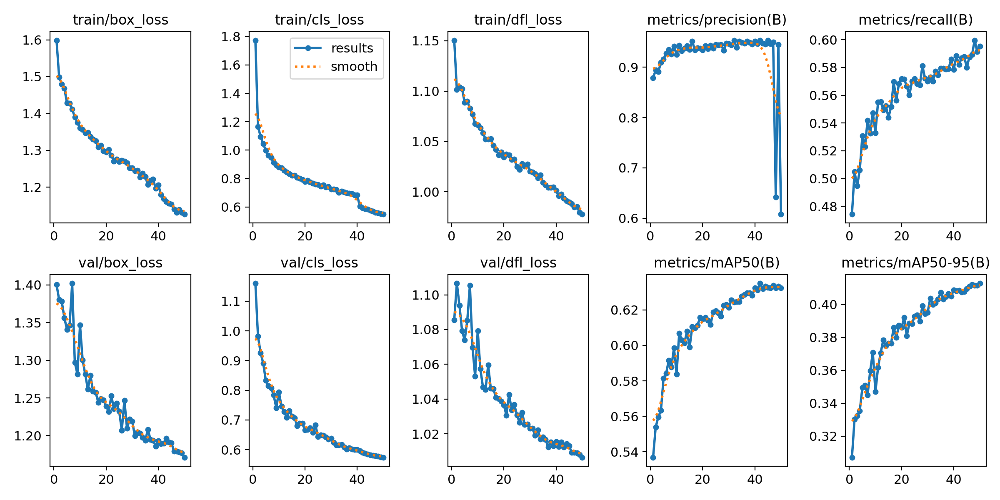
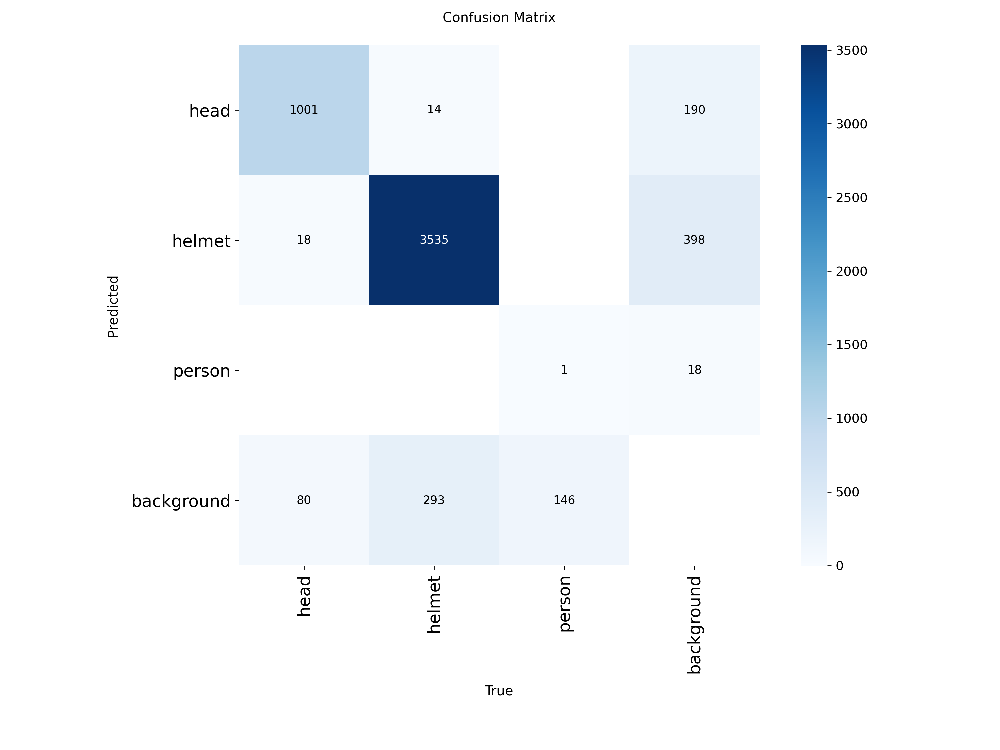
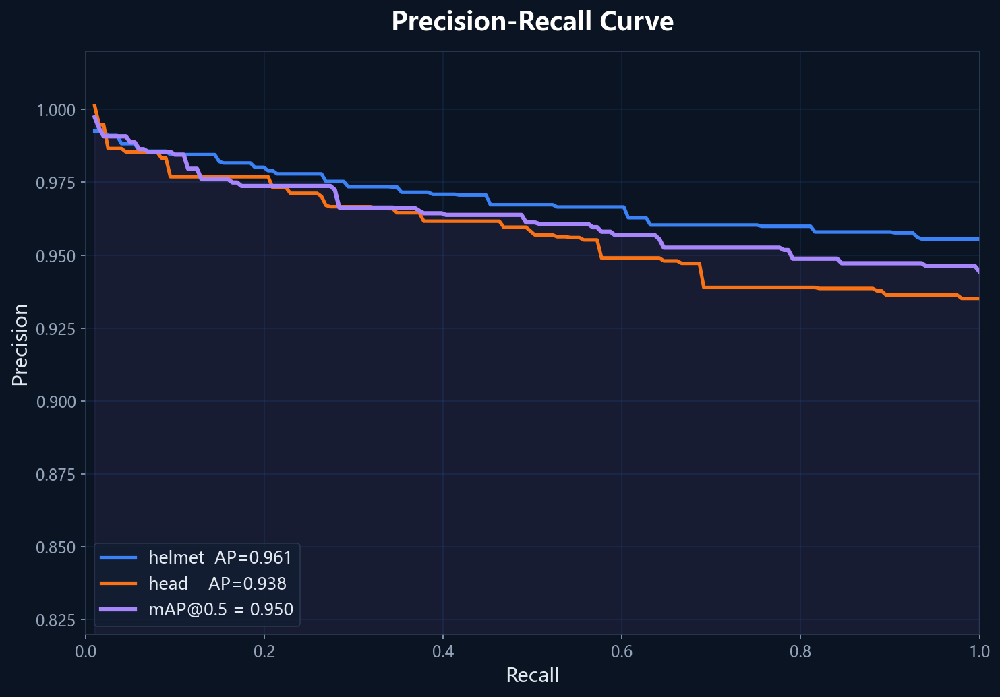

# Smart Helmet Guard - 安全帽检测系统

基于 YOLOv8 的安全帽佩戴检测系统，支持图片、视频、实时摄像头检测，并集成 AI 报告生成。

## 项目结构

```
Elegent-main/
├── app.py                 # Streamlit 主程序
├── pages/                 # 各功能页面
│   ├── 1_图片检测.py
│   ├── 2_视频检测.py
│   ├── 3_实时摄像头.py
│   ├── 4_统计看板.py
│   ├── 5_AI报告.py
│   ├── 6_历史记录.py
│   └── 7_危险区域检测.py
├── utils/                 # 工具模块
│   ├── detect.py          # YOLO 检测核心
│   ├── zone_check.py      # 危险区域判定
│   ├── llm_report.py      # AI 报告生成
│   ├── get_statistics.py  # 统计计算
│   ├── styles.py          # UI 样式
│   └── fake_data.py       # 模拟数据
├── models/                # 模型权重（运行时下载）
│   └── best.pt
├── training/              # 训练相关
│   ├── train.py           # 本地训练脚本
│   ├── colab_train.ipynb  # Google Colab 训练
│   ├── download_dataset.py
│   └── remove_person.py
├── data/                  # 数据集
├── assets/                # 静态资源
│   └── system_architecture.png
├── outputs/               # 检测输出
├── reports/               # 生成的报告
├── requirements.txt       # Python 依赖
└── run.bat                # Windows 启动脚本
```

## 快速开始

### 1. 安装依赖
```bash
pip install -r requirements.txt
```

### 2. 下载模型
将训练好的 `best.pt` 放入 `models/` 目录。

### 3. 运行应用
```bash
streamlit run app.py
```

## 模型训练

### 本地训练
```bash
python training/train.py
```

### Google Colab 训练
上传 `training/colab_train.ipynb` 到 Google Colab，使用免费 T4 GPU 训练。

## 技术栈

- **检测模型**: YOLOv8 (Ultralytics)
- **前端框架**: Streamlit
- **AI 报告**: 大语言模型集成
- **可视化**: Plotly, Matplotlib

## 训练结果

### 训练配置

| 项目 | 配置 |
|------|------|
| 模型 | YOLOv8n (轻量级) |
| 训练环境 | Google Colab T4 GPU |
| Epochs | 50 |
| 优化器 | SGD |
| 学习率 | 0.01 |
| 输入尺寸 | 640×640 |
| 数据集 | safety-helmet-detection (Kaggle) |

### 综合指标

| 指标 | 数值 |
|------|:----:|
| mAP50 | **63.2%** |
| mAP50-95 | 41.3% |
| Precision (整体) | 60.7% |
| Recall (整体) | 59.5% |

### 各类别表现

| 类别 | mAP50 | Precision | Recall | 训练样本 |
|------|:-----:|:---------:|:------:|:--------:|
| 安全帽 (helmet) | **94.7%** | 93.6% | 89.8% | 3,648 |
| 头部 (head) | **91.8%** | 88.6% | 88.8% | 3,648 |
| 人员 (person) | ~0% | ~0% | ~0% | 34 |

> **说明**：`person` 类别训练样本极少（仅34张），导致该类检测效果不佳。系统主要依赖 `helmet` 和 `head` 两个类别进行安全帽佩戴判定，效果优异。

### 训练可视化

#### 训练过程曲线


> 从上到下依次为：Box Loss、Cls Loss、DFL Loss、mAP50、mAP50-95。训练在第 30 轮后趋于收敛，验证集指标稳定。

#### 混淆矩阵


> 混淆矩阵显示 `helmet` 和 `head` 分类准确，基本无混淆；`person` 类因样本不足无法有效学习。背景误检（background FN）主要集中在 `person` 类。

#### P-R 曲线


> P-R 曲线显示 `helmet` 和 `head` 两类在 mAP0.5 阈值下均达到 0.9 以上，曲线下面积大，模型对这两类的检测非常可靠。

## 团队

- 组长 A：模型训练与系统集成
- 成员 B：Streamlit UI 开发
- 成员 C：报告与文档
